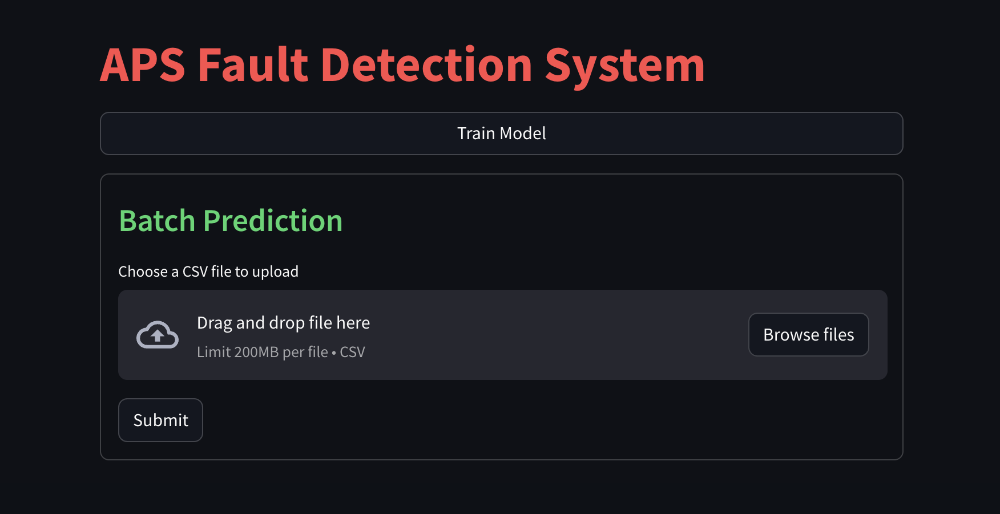
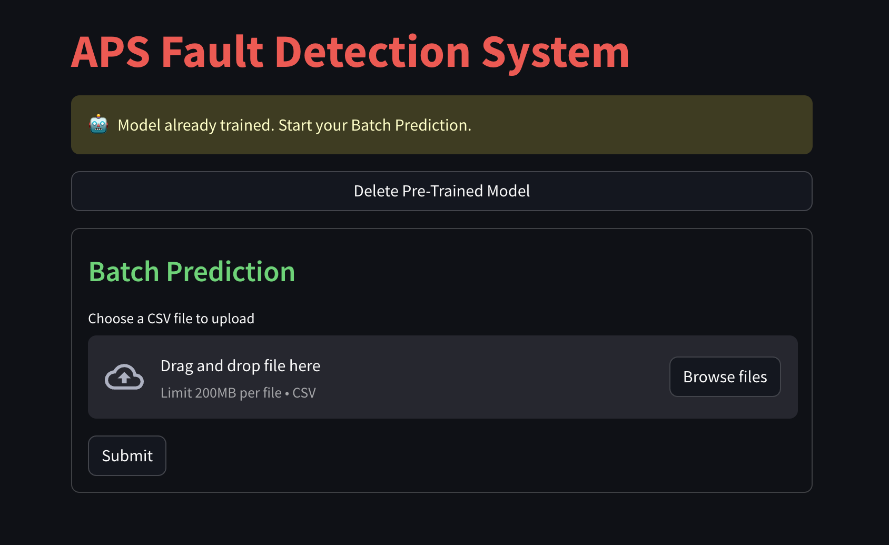

# APS-Fault-Detection

## Problem Statement

- A heavy-duty vehicle's Air Pressure System (APS) is a crucial part that uses compressed air to push a piston and provide pressure to the brake pads, slowing the vehicle down. The ease of obtaining and long-term sustainability of natural air make an APS preferable to a hydraulic system.

- This is a binary classification issue, in which the positive class denotes that a certain APS component was responsible for the failure while the negative class denotes that a different factor was responsible.

## Solution Proposed

- The Air Pressure System (APS), which produces pressurized air used for numerous vehicle tasks including braking and gear changes, is the system that is the focus of this research. The dataset's positive class relates to component failures for a certain APS system component. The negative class applies to vehicles having issues with non-APS system-related parts.

- The challenge is to reduce costs associated with unneeded repairs. Thus, it is necessary to reduce the number of erroneous forecasts.

## Tech Stack Used
1. Python
2. Machine learning algorithms
3. MongoDB
4. AWS
5. Streamlit
6. Git

## Project Pipeline
1. Data Ingestion
2. Data Validation
3. Data Transformation
4. Model Training
5. Model Evaluation
6. Model Deployment

## 1. Data Ingestion:

Data ingestion is the process in which unstructured data is extracted from one or multiple sources and then prepared for training machine learning models. Here we have extracted data from Mongo DB using data_dump.py file.

## 2. Data Validation:

- Data validation is an integral part of ML pipeline. It is checking the quality of source data.

- If there are no missing columns in both train and test data files it check for data drift and gives a brief report.

## 3. Data Transformation

Data transformation is the process of converting raw data into a format or structure that would be more suitable for model building.

## 4. Model Training

Model training in machine learning is the process in which a machine learning (ML) algorithm is created or selected and fed with sufficient training data so that it could learn and give accurate predictions in the future.

## 5. Model Evaluation

- Model evaluation is the process of using different evaluation metrics to understand a machine learning model’s performance, as well as its strengths and weaknesses.

- Model evaluation is important to assess the efficacy of a model during initial research phases, and it also plays a role in model monitoring.

## 6. Model Deployment

Deployment is the method by which we integrate a machine learning model into production environment to make practical business decisions based on data.

## Documentation

- [Architecture](./docs/Architecture.pdf)
- [DPR](./docs/DPR.pdf)
- [LLD](./docs/LLD.pdf)
- [HLD](./docs/HLD.pdf)
- [Wireframe](./docs/Wireframe.pdf)

# WebPage URL

https://ineuroninternship-issac2ykkzewtwkdbvc8yl.streamlit.app/

## UI Screenshots

